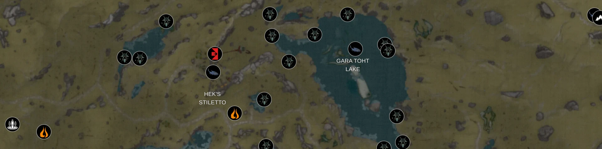
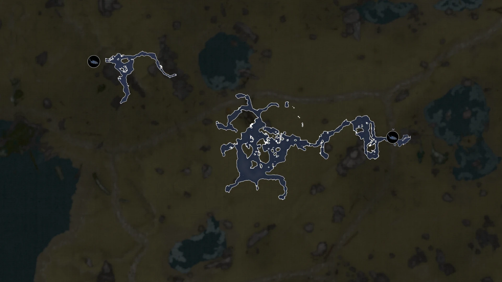
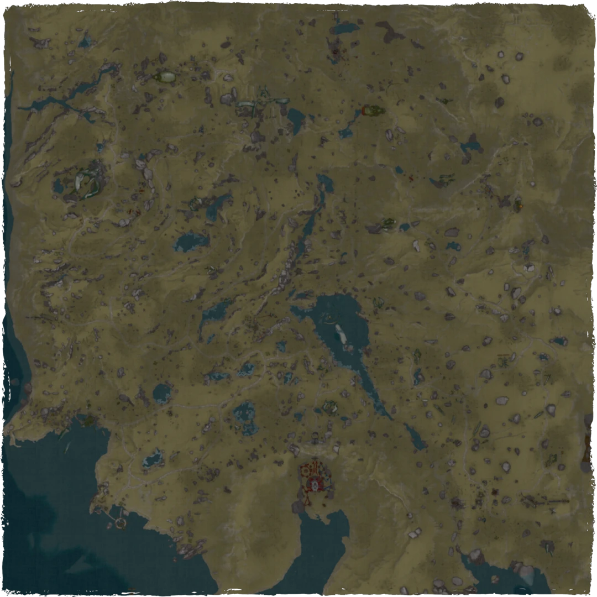
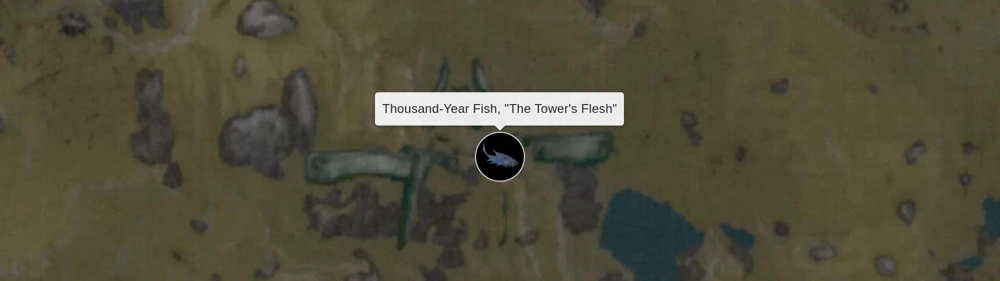

# Plains of Eidolon Interactive World Map



View locations of Cetus Wisps, Thousand-Year Fish Statuettes and more on an interactive map with surface and cave views.

## Features

- All Thousand-Year Fish locations.
- Many Cetus Wisp locations.
- Surface and Cave view.
- High quality map tiles.
- Fullscreen mode.
- Installable as Progressive Web App.

## Cave view



This map offers a "Cave view" that allows to see the underground locations of Plains of Eidolon. Thousand-Year Fish Statuettes are marked precisely to the point in the cave where they reside.

## Map creation process



The map was created by combining ~30 screenshots of in-game Plains map at max zoom level. Text and icons got cleaned up. The result was a 6478x6478 image that has then been converted to map tiles using gdal2tiles.py script.

## Marker data

Things like Grinner Outposts, Blinkpads, caves and location names got taken directly from the map scans. Cetus Wisps data was gather over a few in-game night cycles by flying over the Plains using an Archwing with a Kavat and an Animal Instinct mod.



Bounty Consoles and Thousand-Year Fish Statuette locations are based on information from [Warframe Wiki](https://warframe.fandom.com/wiki/WARFRAME_Wiki). The placement of each marker was checked in-game to ensure its proper position.

## How to run the map locally

1. Clone the project.

   ```
   git clone https://github.com/mitonik/poe-map
   ```
2. Install dependancies.
   ```
   npm install
   ```

3. Build the project.
   ```
   npm run build
   ```

4. Start a preview server.
   ```
   npm run preview
   ```

5. Go to http://localhost:4173/.
